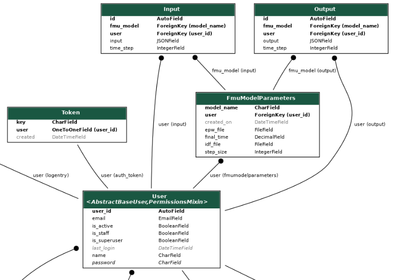
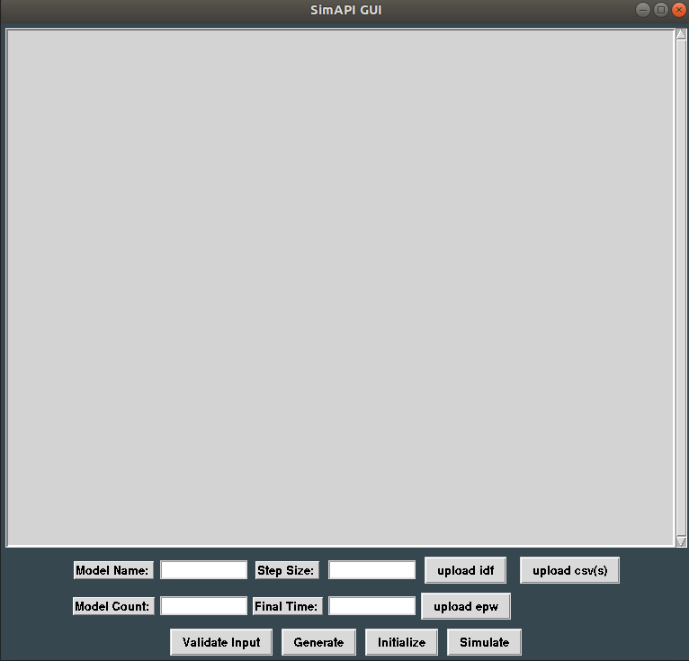

# SimApi Building Energy Co-Simulation Platform

This project aims to update and re-design an existing project found at [SimAPI repo](https://github.com/ElsevierSoftwareX/SOFTX_2018_29).
The objective of this project is to re-design and update the linked project using python, Django rest framework, 
Celery, Docker, and pyFMI to create an application capable of co-simulation between an Energy Management System and
a Functional Mock-Up Unit. The end goal is to deploy the project on a Docker swarm and simulate multiple fmu models
simultaneously. 

## Prerequisites
Version of docker and docker-compose 
```
Docker
- version >= 18.09.9

Docker-compose
- version >= 1.25.0
```


### Project structure

``` 
.
├── LICENSE
├── README.md
├── run_gui.py  # run to show gui 
├── setup.py
├── src     #  Each sub-folder represents a docker container
│   ├── docker-compose.yml
│   ├── fmu_generator 
│   │   ├── celeryconfig.py
│   │   ├── Dockerfile
│   │   ├── Energy+.idd
│   │   ├── energy_plus_to_fmu.py
│   │   ├── generator_api.py
│   │   ├── generator_tasks.py
│   │   ├── requirements.txt
│   │   └── run.sh
│   ├── fmu_simulator
│   │   ├── conda_requirements.txt
│   │   ├── Dockerfile
│   │   ├── fmu_data
│   │   │   └── time_step.txt
│   │   ├── __init__.py
│   │   ├── requirements.txt
│   │   ├── run.sh
│   │   ├── simulation_process.py
│   │   ├── simulator
│   │   │   ├── simulation_obj.py
│   │   │   └── test_simulation_obj.py
│   │   └── simulator_api
│   │       └── sim_api.py
│   ├── input_output_router
│   │   ├── celeryconfig.py
│   │   ├── Dockerfile
│   │   ├── __init__.py
│   │   ├── requirements.txt
│   │   ├── router_api.py
│   │   ├── router_tasks.py
│   │   └── run.sh
│   └── simapi_web
│       ├── Dockerfile
│       ├── manage.py
│       ├── Media
│       ├── requirements.txt
│       ├── rest_api
│       │   ├── admin.py
│       │   ├── apps.py
│       │   ├── __init__.py
│       │   ├── migrations
│       │   │   ├── 0001_initial.py
│       │   │   └── __init__.py
│       │   ├── models.py
│       │   ├── permissions.py
│       │   ├── schema.py
│       │   ├── serializers.py
│       │   ├── tasks.py
│       │   ├── tests
│       │   │   ├── __init__.py
│       │   │   ├── test_models.py
│       │   │   └── test_views.py
│       │   ├── urls.py
│       │   └── views.py
│       └── simapi_web
│           ├── asgi.py
│           ├── celery.py
│           ├── __init__.py
│           ├── schema.py
│           ├── settings.py
│           ├── urls.py
│           └── wsgi.py
├── test_setup_files
│   ├── update.epw
│   └── update.idf
├── user_interface_controller.py
└── user_interface.py

```

### API Database ER Diagram


## Instructions
To build and run the containers navigate to src folder and type in a terminal

```
docker-compose build

Once build is finished bring up the db container to initialize it. Only needed for the first time after building.

docker-compose up -d db

Then bring the rest of the system up. No -d flag as you will need to see the output.

NOTE: To run multiple simulations run docker-compose up --scale simulator=n, where n is the desired number of simulations

For a single simulation run

docker-compose up

On Linux sudo will be needed
```

### GUI
Below is a screenshot of the user interface. It's very basic but makes it easier to run the system. 


##### Input Fields
Model Name: Any string value. Must be unique for generating different FMUs

Model Count: Number of simulator containers currently running

Step Size: Integer value corresponding to length of time in seconds of each time step

Final Time: Float value corresponding to length of time in hours the simulation spans. Min value = 24.0. 

##### Buttons
Upload idf: Opens a file select window. Choose .idf

Upload epw: Opens a file select window. Choose .epw

Validate Input: Click validate input to check if inputs are correct.

Generate: After input validated click to generate the FMU.

Initialize: After generating the FMU click to initialize the FMU

Simulate: After initializing the FMU click to run the simulation(s)

###### Instructions 
Use docker-compose up or --scale to run the desired number of simulator containers.

Once all containers are running, run the gui script **run_gui.py** located in the project root folder.

Fill all input fields and select .idf and .epw files. 

Validate the inputs are correct then, Generate, Initialize, Simulate.

Check for a confirmation message in the text area before clicking consecutive buttons.

##### Workflow
Use docker-compose up --scale simulator=n to test different values for n, after 5 memory may be an issue depending
on host machine specs. Tested up to 65 simulations using roughly 14 GiB of memory, taking roughly 30-40 minutes to
complete all simulations.

Ensure that the model count value in the UI you enter is the same as the value used to --scale the simulator container.
If no --scale command was used the value entered for model count is 1.

When the simulation(s) have finished bring down the containers with ctrl-c, it is possible to use previously generated
FMUs if you would like to test with a different number of simulator containers. Use docker-compose to --scale the container
to a desired value, then in the UI just change the model count value, skip the Generate step and go straight to Initialize. 
This will initialize the previously generated FMU which is stored in the generator container.

Notes: The gui simulate command is hardcoded to only run an FMU generated using the test update.idf and update.epw.
       There is currently no way to upload inputs. A test input file is needed to implement this feature. Maybe a test
       cvs file that the user can upload. Also a feature to download the generated FMU is needed.


To wipe the data from the database and containers run. 

```
docker-compose down --volumes
```
Then initialize the database again with
```
docker-compose up -d db 
```

If testing the system multiple times with different numbers of simulator containers it is a good idea to wipe the data
and also run the command below to remove any hanging containers from the host machine. It may take sometime to complete!
```
docker system prune
```
Hanging containers can quickly take up a lot of space.

## Project Development

If you would like to run the Django API or simulation scripts without docker the following steps are required.

1. Install python Anaconda

2. Create a virtual env python=3.7

3. Run conda commands

   conda config --append channels conda-forge
   
   conda install -c conda-forge assimulo
   
   conda install -c https://conda.binstar.org/chria pyfmi

4. pip install -r [dev_requirements.txt](doc/dev_requirements.txt) to install project dependencies

If running the Django project without Docker is all that is required then you can stop here. 

If you would also like to run simulation scripts then it is necessary to install energyPlus on your machine. 

Version 9 is required.

For windows installation see [energyPlus windows](https://energyplus.net/installation-windows)

For Linux installation see  [energyPlus Linux](https://energyplus.net/installation-linux)


